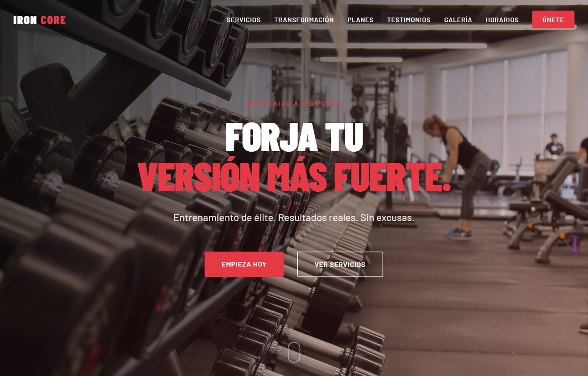

# IRON CORE

Landing page for a gym brand. Services, membership plans, transformations, testimonials, gallery and schedule, with a lead form CTA.

[](https://landing-gimnasio-kir.vercel.app)



**Demo:** https://landing-gimnasio-kir.vercel.app

## What it includes

- Dark hero with dual CTAs
- Services grid, pricing plans and before/after strip
- Testimonials, gallery, schedule table and signup form
- Static site: no build step required

## Stack

HTML, CSS, Vanilla JavaScript, Vercel

## Run locally

```bash
git clone https://github.com/JpSiesquen/Landing-Gimnasio-Kir.git
cd Landing-Gimnasio-Kir
```

Open `index.html` in the browser, or serve the folder:

```bash
npx --yes serve .
```

## Author

**Jonathan Siesquen** · [GitHub](https://github.com/JpSiesquen) · [LinkedIn](https://www.linkedin.com/in/jpsiesquen/)